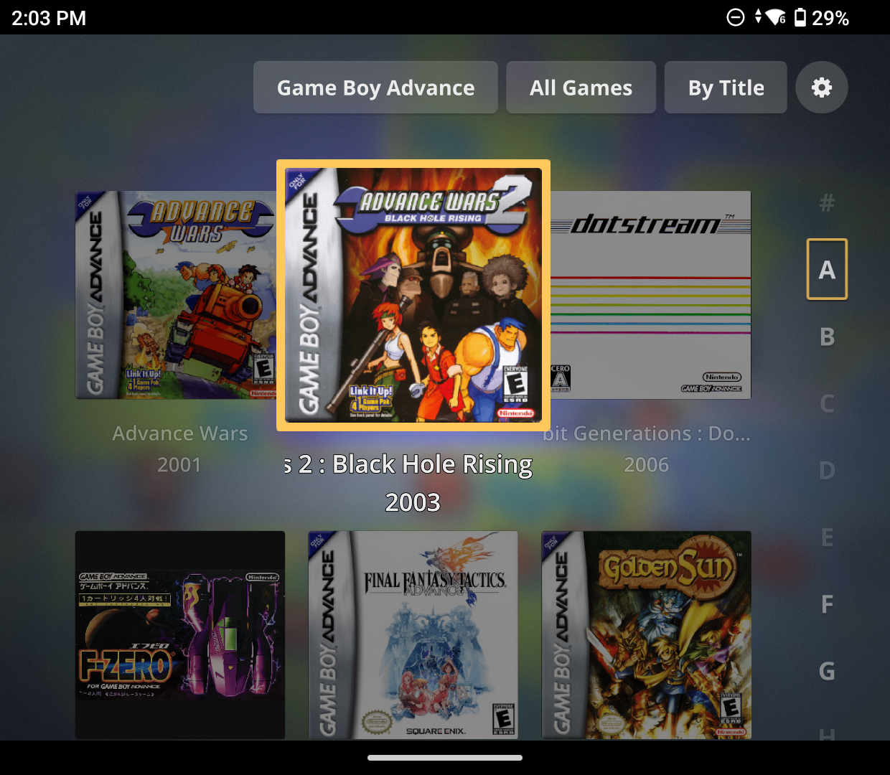
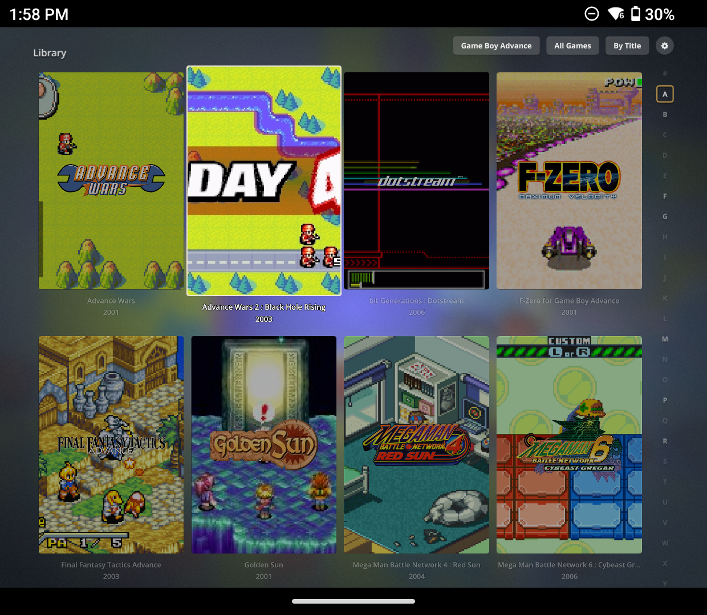
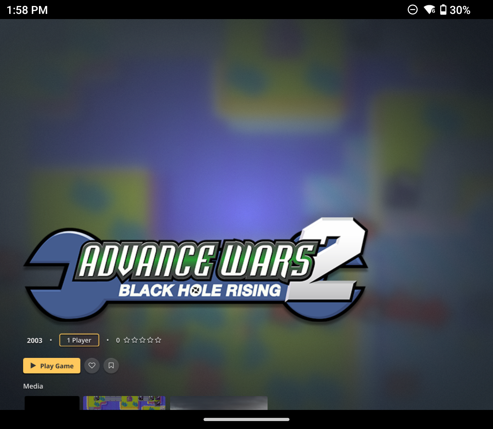
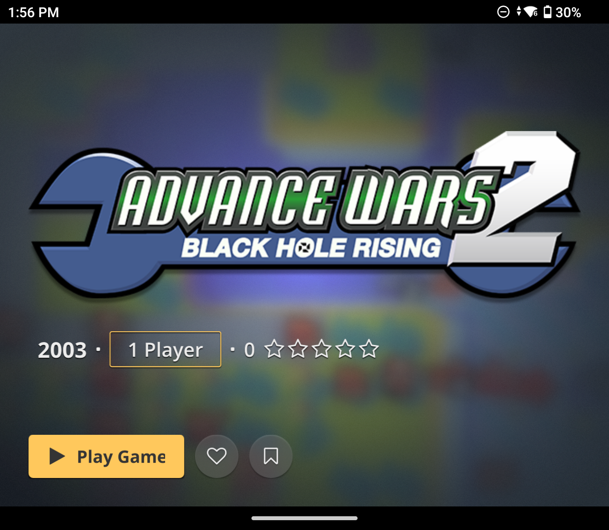
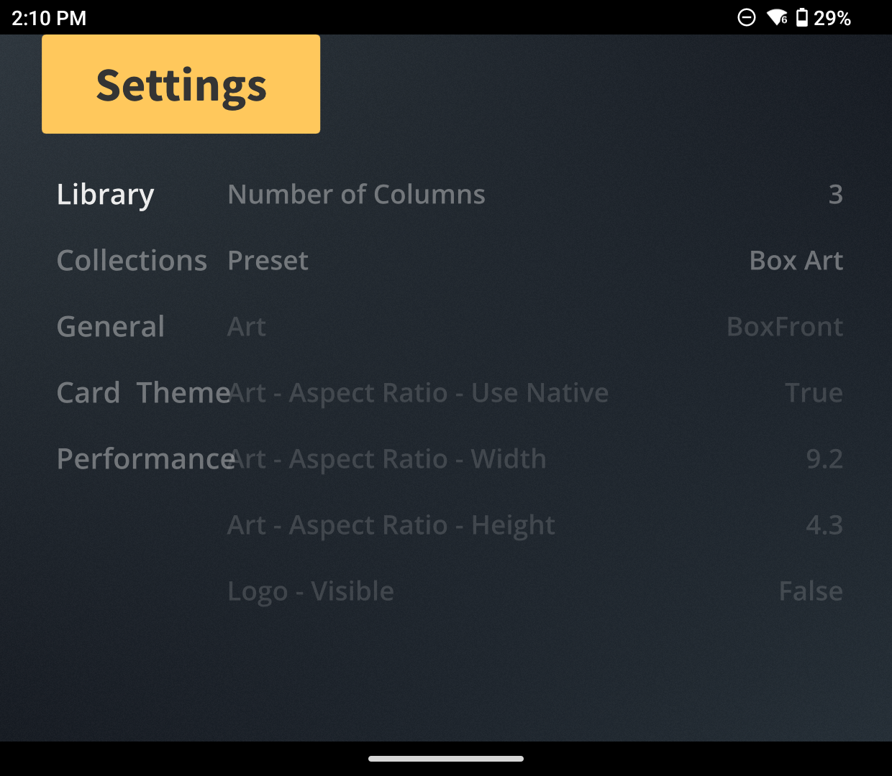
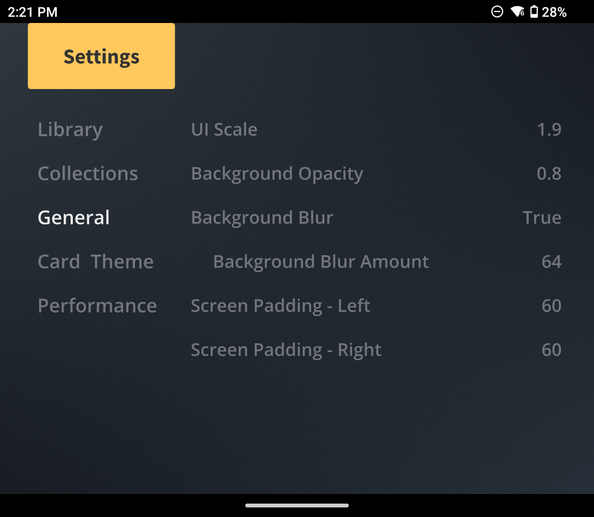

# Minimis: Retroid Pocket Mini V2 Edition

A tweaked version of Charles Waldner's Minimis theme for Pegasus, optimized for display on the Retroid Pocket Mini V2 (and potentially other devices).

## Screenshots

Default

Optimized

Default

Optimized

Default

Optimized
